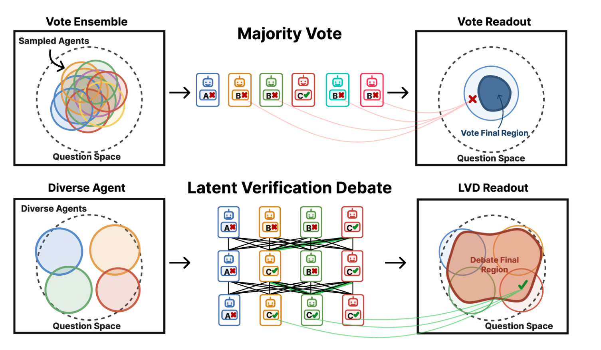

# [NeurIPS 2026] When Debate Helps: Proposal Supply and Verification-Aware Readout in Multi-Agent Reasoning

**Accepted at NeurIPS 2026**

This repository contains an independent reference implementation for the following work:

- **When Debate Helps: Proposal Supply and Verification-Aware Readout in Multi-Agent Reasoning**<br>
  Zihao Zhao¹, Tunyu Zhang², Haizhou Shi²˒³, Yusong Zhao¹, Xinxi Zhang², Hao Wang¹<br>
  ¹ University of Illinois Urbana-Champaign · ² Rutgers University · ³ Salesforce AI Research

Debate can improve on majority voting when agents supply complementary candidate answers and the readout uses verification evidence to recover correct minority proposals. The paper studies these two mechanisms through recoverable headroom, Latent Verification Debate (LVD), and coverage-based selection of neural-thicket agents.



**Figure 1. Overview of the supply-readout view.** Transparent regions denote questions for which individual sampled agents can surface the correct answer; solid regions denote questions recovered by the final readout. Top: overlapping sampled agents provide redundant proposal coverage. Bottom: diverse agents provide complementary coverage, and LVD uses verification-aware evidence to recover a surfaced correct minority answer. [Vector PDF](assets/figure1.pdf) · [Figure source](assets/README.md)

The code implements the core experiment pipeline:

1. sample deterministic full-weight Gaussian perturbations;
2. profile each perturbation on a construction split;
3. select a fixed society with Top-Accuracy, AC-Greedy, or label-free SC-Greedy;
4. run majority vote or multi-round verification-aware debate;
5. save every response and judge trace, then measure proposal hit, recoverable headroom, recovery, and damage.

## Release Status

This is an independent reference implementation of the paper's core profiling, selection, and debate pipeline. The Qwen paper configuration generates a 500-candidate pool with the camera-ready scale counts (160/174/166), evaluates the R3 readout, and uses SC@20 for the self-consistency baseline.

SC-Greedy resolves equal coverage objectives with a reproducible random choice controlled by `--tie-break-seed`; labels and construction accuracy do not participate in its tie-breaking. The shard launcher stops before merging if any profiling worker fails and validates the merged candidate IDs against the seed bank. See [the release-readiness audit](docs/RELEASE_READINESS.md) for validation details and release scope.

Paper and proceedings links will be added when public. Author names and affiliations above come from the camera-ready TeX.

## Install

```bash
python -m venv .venv
source .venv/bin/activate
pip install -e '.[dev]'
```

Python 3.10+, PyTorch, and Hugging Face Transformers are required. Model weights and benchmark data are not included. See [docs/DATA.md](docs/DATA.md) for the normalized JSONL schema.

## Debug run

The included arithmetic fixture exercises the complete pipeline with ten perturbations. It is for software validation, not a research result.

```bash
CUDA_VISIBLE_DEVICES=0 bash scripts/run_debug.sh
```

To use a local checkpoint or reduce the run further:

```bash
CUDA_VISIBLE_DEVICES=0 wdh seed-bank \
  --config configs/debug.yaml \
  --set seed_bank.seeds_per_sigma=1 \
  --output runs/smoke/seed_bank.jsonl

CUDA_VISIBLE_DEVICES=0 wdh profile \
  --config configs/debug.yaml \
  --set model.name_or_path=/path/to/Qwen2.5-0.5B-Instruct \
  --set model.device=cuda:0 \
  --candidates runs/smoke/seed_bank.jsonl \
  --output runs/smoke/profiles.jsonl
```

## Paper-Scale Workflow (Reference Configuration)

First prepare disjoint construction and test JSONL files, update their paths in `configs/qwen3_4b_paper.yaml`, and create the seed bank:

```bash
wdh validate-data data/benchmark/train.jsonl
wdh validate-data data/benchmark/test.jsonl
wdh seed-bank \
  --config configs/qwen3_4b_paper.yaml \
  --output runs/qwen3-4b/seed_bank.jsonl
```

Profile on four GPUs. Each process loads one model, evaluates a deterministic shard, and can resume its own JSONL file:

```bash
bash scripts/launch_profile_shards.sh \
  configs/qwen3_4b_paper.yaml \
  runs/qwen3-4b/seed_bank.jsonl \
  runs/qwen3-4b/profile \
  0 1 2 3
```

Select the three fixed teams:

```bash
for method in top_accuracy ac_greedy sc_greedy; do
  wdh select \
    --profiles runs/qwen3-4b/profile/profiles.jsonl \
    --output "runs/qwen3-4b/team-${method}.json" \
    --method "${method}" \
    --team-size 4 \
    --tie-break-seed 42
done
```

Run three-round debate with all traces and the vote-then-judge tiebreak readout:

```bash
CUDA_VISIBLE_DEVICES=0 wdh evaluate \
  --config configs/qwen3_4b_paper.yaml \
  --set model.device=cuda:0 \
  --team runs/qwen3-4b/team-sc_greedy.json \
  --output-dir runs/qwen3-4b/sc-greedy-r3
```

The same trace format supports the base-model baselines. For example, run SC@20 with no judge, or four-agent Vanilla Debate at R3:

```bash
CUDA_VISIBLE_DEVICES=0 wdh evaluate-base \
  --config configs/qwen3_4b_paper.yaml \
  --set debate.rounds=0 \
  --agents 20 \
  --no-judge-ties \
  --output-dir runs/qwen3-4b/sc20

CUDA_VISIBLE_DEVICES=0 wdh evaluate-base \
  --config configs/qwen3_4b_paper.yaml \
  --agents 4 \
  --output-dir runs/qwen3-4b/vanilla-debate-r3
```

Base-model agents use the stochastic `generation.base` block, while thicket agents and the tie-break judge use their separate deterministic generation blocks.

The camera-ready output budget is 8192 tokens for AMC12 and MATH500, which is the default in `configs/qwen3_4b_paper.yaml`. GPQA and MMLU-Redux use 4096 tokens. For those datasets, override the relevant generation blocks, for example:

```bash
wdh profile \
  --config configs/qwen3_4b_paper.yaml \
  --set generation.profile.max_new_tokens=4096 \
  ...

wdh evaluate \
  --config configs/qwen3_4b_paper.yaml \
  --set generation.eval.max_new_tokens=4096 \
  --set generation.judge.max_new_tokens=4096 \
  ...

wdh evaluate-base \
  --config configs/qwen3_4b_paper.yaml \
  --set generation.base.max_new_tokens=4096 \
  --set generation.judge.max_new_tokens=4096 \
  ...
```

The output budget can affect results when a response reaches the generation limit, especially on long mathematical solutions. Matching it is therefore required for a paper-comparable run even though shorter responses are unchanged.

`summary.json` contains aggregate and round-level metrics. `traces.jsonl` retains initial responses, every debate response, extracted answers, correctness, votes, and tie-break judge outputs. Metrics can be recomputed without generation:

```bash
wdh analyze \
  --traces runs/qwen3-4b/sc-greedy-r3/traces.jsonl \
  --output runs/qwen3-4b/sc-greedy-r3/summary-recomputed.json
```

## Reproducibility controls

- Candidate seeds and scales are generated from the configured global seed and saved to `seed_bank.jsonl` for each run.
- Profile sharding is deterministic by candidate index.
- Every profiling worker must succeed, and the merged profile IDs must exactly match the seed bank.
- Existing candidate IDs are skipped when profiling resumes.
- Full-weight perturbations restore from a CPU snapshot, not by subtracting low-precision noise.
- Exact tensor restoration is checked after every candidate by default.
- Invalid answer extractions contribute zero SC-Greedy coverage.
- SC-Greedy uses seeded random tie-breaking that is independent of labels and accuracy.
- Run manifests record the resolved config, Python and PyTorch versions, CUDA version, device, commit, and parameter counts.

See [docs/IMPLEMENTATION.md](docs/IMPLEMENTATION.md) for method details and memory tradeoffs.

## Citation

```bibtex
@inproceedings{zhao2026whendebatehelps,
  title     = {When Debate Helps: Proposal Supply and Verification-Aware Readout in Multi-Agent Reasoning},
  author    = {Zhao, Zihao and Zhang, Tunyu and Shi, Haizhou and Zhao, Yusong and Zhang, Xinxi and Wang, Hao},
  booktitle = {Advances in Neural Information Processing Systems},
  year      = {2026}
}
```

Proceedings identifiers, pages, and a public paper URL will be added when available.

## License

Code and documentation are licensed under Apache-2.0. Model weights and datasets are not covered by this license; see [THIRD_PARTY.md](THIRD_PARTY.md).
